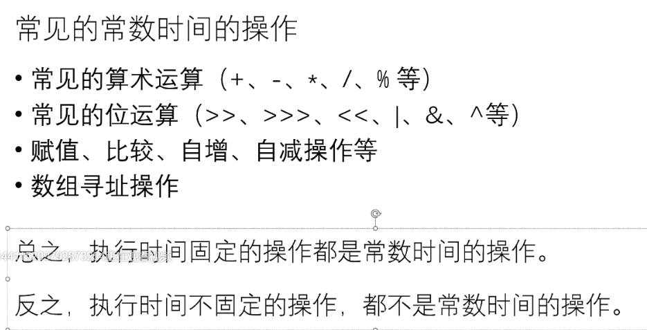
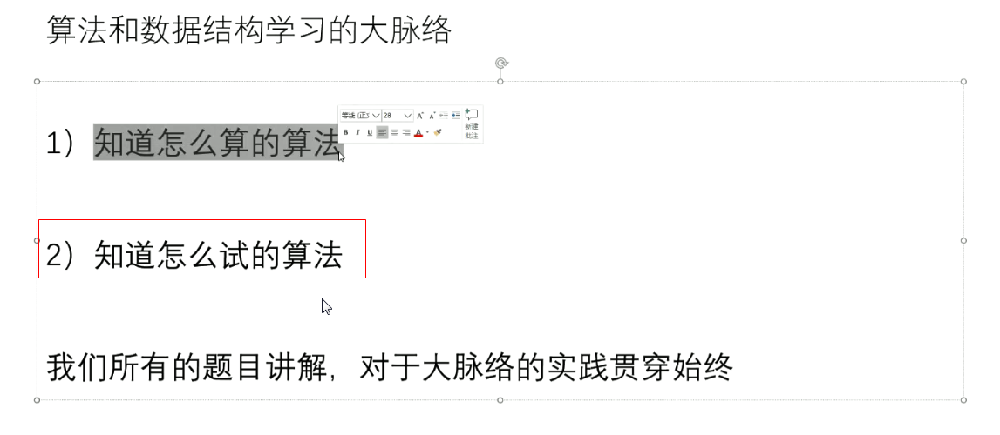
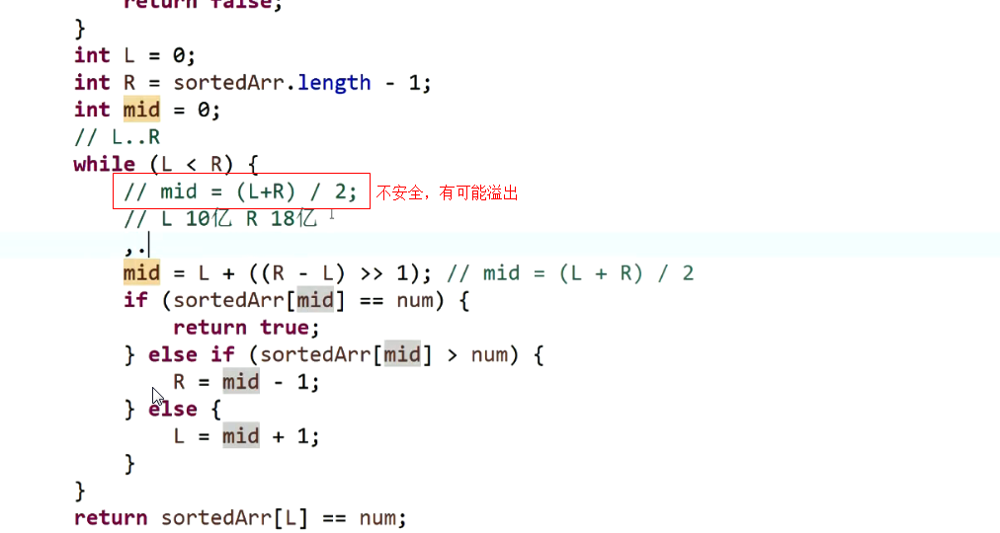

# 认识复杂度、对数器、二分法与异或运算（1）
1.动态规划技巧，树形DP
算法->流程
1.指标
常数时间操作，常见四则运算，位运算

位运算
数组寻址，算偏移量来实现，java如何实现数组？基础类型，object类型数组。
时间复杂度，多少个常数时间操作。

$an^2+bn+c$
  

**最高阶->时间复杂度,**
选择 冒泡 插入排序
三个指标
    时间复杂度、额外空间复杂度、常数复杂度。
    

**对数器**

**只要出现排他性原则就可以二分如无序数组，例找局部最小值。**

异或操作，省略中间变量交换两个数，两个数必须不是同一块内存才可以。