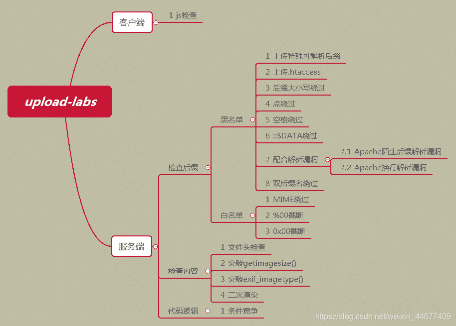

# upload-labs
## Pass01
js,前端限制文件后缀
## Pass02
通过bp修改content-type 
## Pass03
php后缀名在服务器端被限制，上传php3,php4,php5,pht，需要配置apache服务器的 
## Pass04
.htaccess  [https://www.zhaosimeng.cn/writeup/62.html](https://www.zhaosimeng.cn/writeup/62.html)

