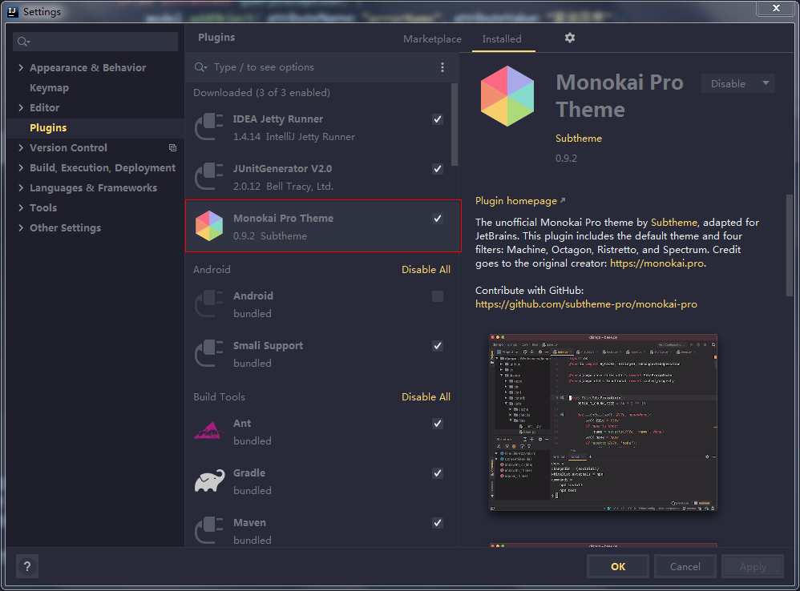
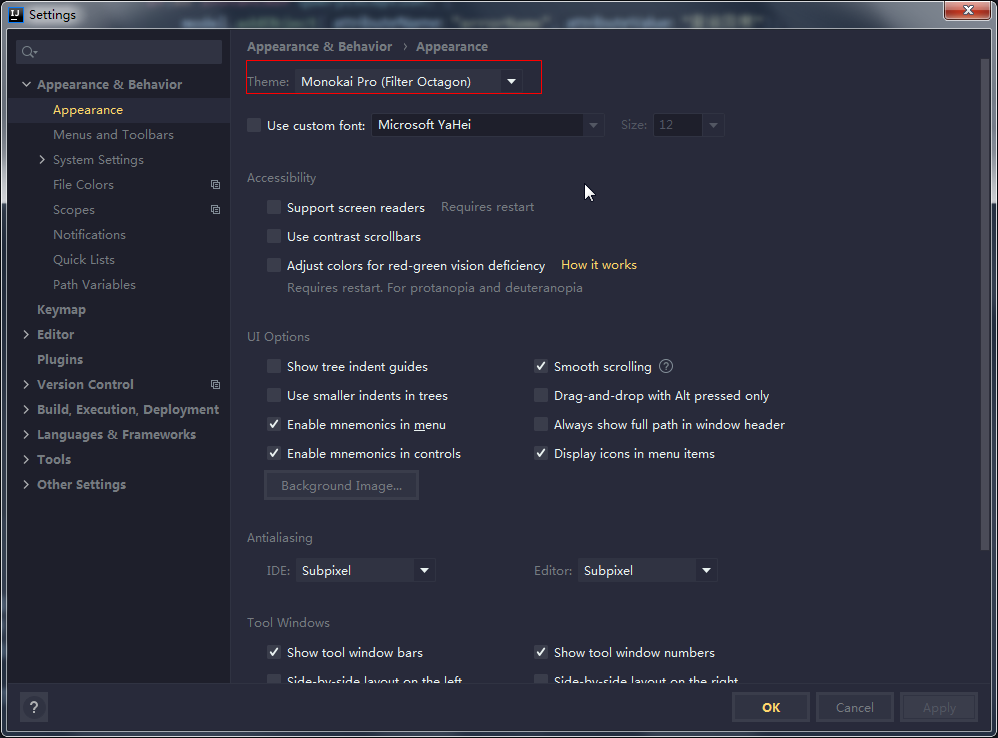
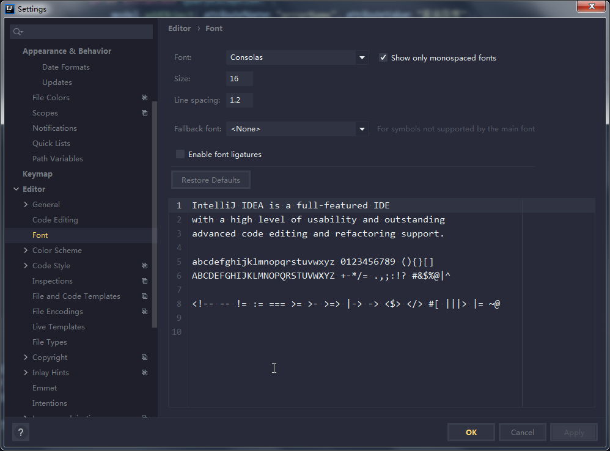
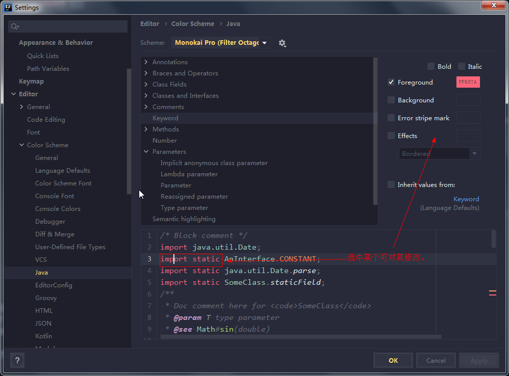
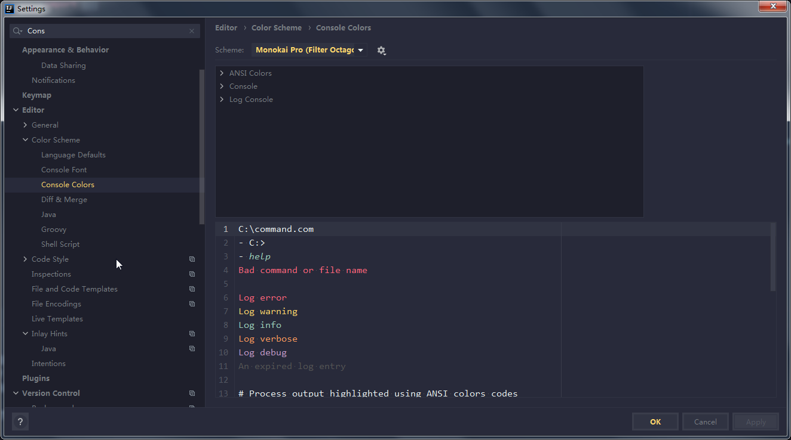
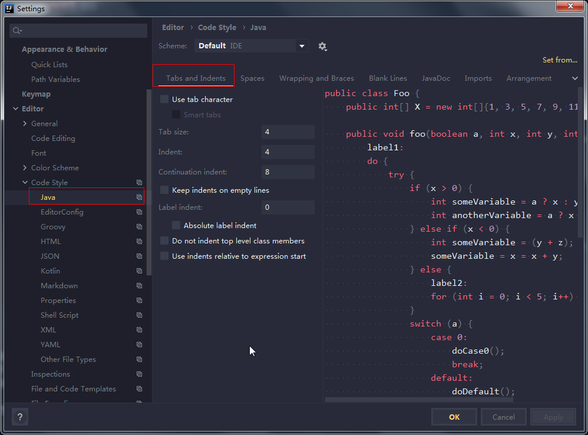
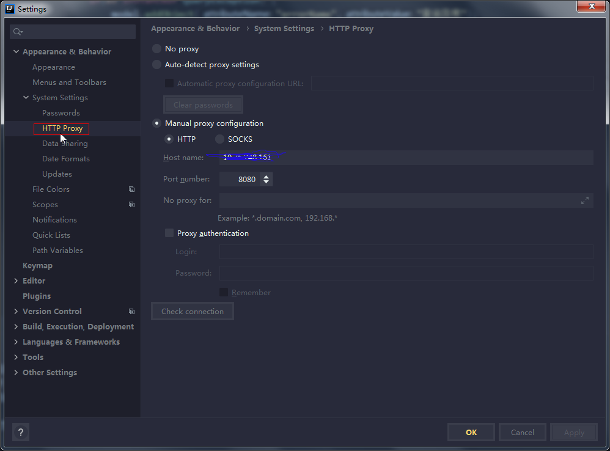

# IDE
## 1.下载idea 社区版
[下载地址](https://www.jetbrains.com/idea/download/#section=windows)
##  2.配置主题
### 2.1 下载主题插件monokai pro


### 2.2选择主题



### 2.3设置编辑器字体



### 2.4设置color theme-java

### 2.5 设置color-theme  console



### 2.6 设置code style



## 3.配置代理


##  4.必备插件
* monokai主体
*  p3c  alibaba编程规范
*  lombok
*  plant uml
*  translation
* jclasslibbyteCode viewer (查看java byte code)
## 5.安装 consolas 字体
```
https://gist.github.com/sigoden/d01ad118da677f796bab01781b7eae23
```
```
wget -O /tmp/YaHei.Consolas.1.12.zip https://storage.googleapis.com/google-code-archive-downloads/v2/code.google.com/uigroupcode/YaHei.Consolas.1.12.zip
unzip /tmp/YaHei.Consolas.1.12.zip
sudo mkdir -p /usr/share/fonts/consolas
sudo mv YaHei.Consolas.1.12.ttf /usr/share/fonts/consolas/
sudo chmod 644 /usr/share/fonts/consolas/YaHei.Consolas.1.12.ttf
cd /usr/share/fonts/consolas
sudo mkfontscale && sudo mkfontdir && sudo fc-cache -fv
```
