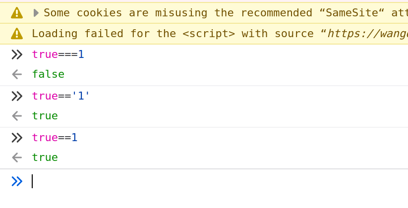
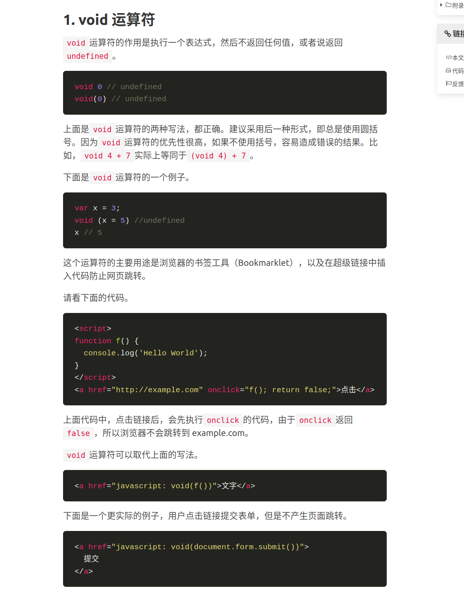
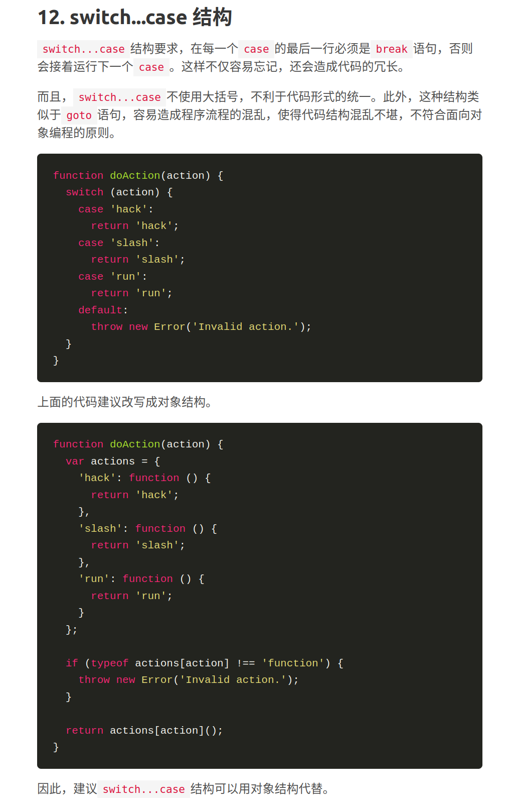

# 0513
```
你需要学习语言的各种功能，而对于 JavaScript，你常常需要学习各种解决问题的模式
```
```
1996年11月，Netscape 公司决定将 JavaScript 提交给国际标准化组织 ECMA（European Computer Manufacturers Association），希望 JavaScript 能够成为国际标准，以此抵抗微软。
ECMA 的39号技术委员会（Technical Committee 39）负责制定和审核这个标准，
成员由业内的大公司派出的工程师组成，目前共25个人。该委员会定期开会，所有的邮件讨论和会议记录，都是公开的。
```
```
JavaScript 引擎的工作方式是，先解析代码，获取所有被声明的变量，然后再一行一行地运行。这造成的结果，就是所有的变量的声明语句，都会被提升到代码的头部，这就叫做变量提升（hoisting）。
```
```
JavaScript 有一些保留字，不能用作标识符：arguments、break、case、catch、class、const、continue、debugger、default、delete、do、else、enum、eval、export、extends、false、finally、for、function、if、implements、import、in、instanceof、interface、let、new、null、package、private、protected、public、return、static、super、switch、this、throw、true、try、typeof、var、void、while、with、yield
```


[浮点数](https://zhuanlan.zhihu.com/p/349572768)


# 函数[function.html](https://wangdoc.com/javascript/types/function.html)
## .4


```
函数执行时所在的作用域，是定义时的作用域，而不是调用时所在的作用域。
```


``` 
arguments
```
```
这就是 JavaScript 语言特有的"链式作用域"结构（chain scope），子对象会一级一级地向上寻找所有父对象的变量。所以，父对象的所有变量，对子对象都是可见的，反之则不成立。
```
```javascript
function createIncrementor(start) {
  return function () {
    return start++;
  };
}

var inc = createIncrementor(5);

inc() // 5
inc() // 6
inc()
```

```
闭包可以看作是函数内部作用域的一个接口。
```
# 数组
```
由于数组成员的键名是固定的（默认总是0、1、2...），因此数组不用为每个元素指定键名，而对象的每个成员都必须指定键名。JavaScript 语言规定，对象的键名一律为字符串，所以，数组的键名其实也是字符串。之所以可以用数值读取，是因为非字符串的键名会被转为字符串。
```











